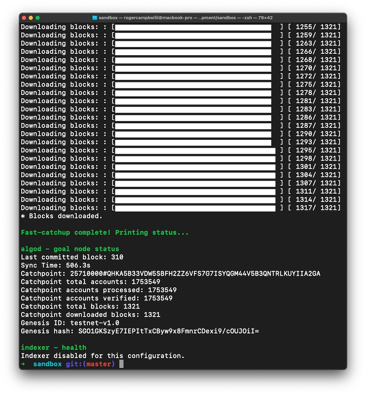

<p align="center">
  
</p>

# Chapter 12.3: Starting an Algorand Node

## What We Are Going To Do

In this section we will learn how to start a Algorand node on the Testnet.

## Learning Objective

By the end of this section student should be able to start their Algorand node on the Testnet.

## Getting Started
1. Navigate into your `sandbox` directory:

```sh
cd ~/algorand-development/sandbox/;
```
2. Start the sandbox:
```sh
./sandbox up testnet
```
* Please not that this command can take up 10-15 mins or longer to finish the initial setup. Just let it run until you see



* If you check your `Docker Desktop` application's `Containers tab` you will see that it now has a `sandbox` container running.

**Sandbox Commands:**
1. Start sandbox: `./sandbox up testnet`
2. Stop sandbox: `./sandbox down`
3. Reset Setting sandbox: `./sandbox clean`