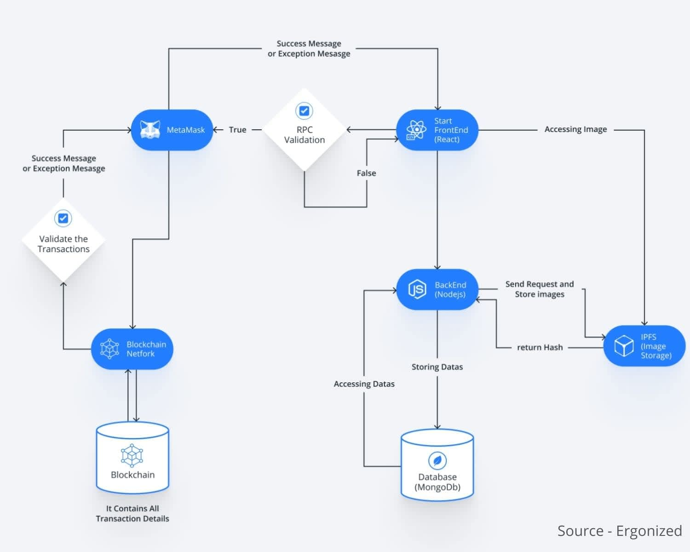

  

# Chapter 9: What Makes The Algorand Network Different

## Learning Objectives

* Identify and explain how the Algorand Network differs from other blockchains
* Describe and discuss the advantages of the Algorand Network
* Understand the common features of the Algorand Network

## Table of Contents

- [Chapter 9: What Makes The Algorand Network Different](#chapter-9-what-makes-the-algorand-network-different)
  - [Learning Objectives](#learning-objectives)
  - [Table of Contents](#table-of-contents)
  - [Founding Principles](#founding-principles)
  - [Algorand Fees](#algorand-fees)
  - [Forking or The Lack Thereof](#forking-or-the-lack-thereof)
  - [Identifying What to Put On-Chain and Off-Chain](#identifying-what-to-put-on-chain-and-off-chain)
  - [Algorand Performance](#algorand-performance)
    - [Throughput](#throughput)
    - [Finality](#finality)
  - [Resources](#resources)
  - [Glossary](#glossary)

## Founding Principles

> "Algorand is a coalition of scientists, engineers, and business professionals, who share a vision to have a better world where people can interact with security and trust. A borderless world where everyone can transact." - Silvio Micali

Algorand, Inc. was founded by cryptography pioneer, Turing award winner, and MIT professor Silvio Micali. Professor Silvio designed the Algorand Network with researchers, mathematicians, cryptographers, and economists to solve the `blockchain trilemma`: security, scalability, and decentralization. Algorand takes a unique approach to the trilemma.

Rather than exerting control over the network, Algorand created a Pure-Proof-of-Stake (PPoS) protocol. The PPos institutes a commonsense approach to security; by making it extremely difficult for a small portion of the community to perform malicious activities and removing any incentive for the majority to do so by entwining stakeholder's holdings to their ability to vote on governance.

Decentralization is a cornerstone of the PPoS protocol, and there is no concept of miners or validators within the Algorand network. Stakeholders are randomly selected to participate as proposers and to partake in committees.

As for scalability, Algorand has fast agreements and can process 1,000 transactions per second. Forking is almost non-existent, so users can rely on new blocks as soon as they are written to the network. Most of all, creating a node on the Algorand network is open to all with its low computation requirements, which also allows the network to remain eco-friendly.

## Algorand Fees

To interact on some Blockchain networks, you must pay a fee in the native cryptocurrency, otherwise known as a `gas fee`.

Algorand has no concept of `gas fees`. Transaction fees are calculated based on the size of the transaction. If network traffic is high for some reason, a user can choose to augment a fee to help prioritize acceptance into a block. Yet outside of a user augmenting their fee, the minimum fee for a transaction is 1,000 microAlgos or .001 Algos.

The Algorand Foundation holds all transaction fees within a wallet address known as the `fee sink`. The `fee sink's address is `Y76M3MSY6DKBRHBL7C3NNDXGS5IIMQVQVUAB6MP4XEMMGVF2QWNPL226CA`.

The Algorand Foundation keeps a "modest amount" of Algo in the `fee sink`. Users who participate in the governance of the network receive payment with these funds.

The only way for this to change would be if the Foundation engaged with the community on how best to leverage the funds to support the ecosystem and then enact agreed-upon change(s) via a community elected consensus upgrade.

At the time of writing, the Algorand Foundation currently has no plans to review the transaction fee level of the Algorand blockchain. You can read more about this in the [Algorand Foundation FAQ](https://algorand.foundation/faq).

## Forking or The Lack Thereof

`Forking` is when a blockchain diverges into two separate paths. `Forking` is a concept that primarily applies to Proof-of-Work blockchains, such as Bitcoin.

`Forking` can be the result of two possible things:
1. Two miners find a block at almost the same time.
2. If a large amount of a blockchain community wants to change a fundamental portion of the protocol.

If two miners were to find a block simultaneously, this could create two separate block paths and cause an accidental divergence of the chain. The problem is that one of the two paths will be abandoned and considered an `orphaned chain`. The transactions on the `orphaned chain` are invalidated, affecting each transaction's finality.

Algorand's Pure-Proof-of-Stake protocol utilizes a voting mechanism to validate blocks, making forking impossible. Even if a voting committee took a long time to reach an agreement, this would only cause the blockchain to slow down or temporarily stall.

## Identifying What to Put On-Chain and Off-Chain

When designing dApps for the Algorand Network, it is paramount to think about which part of the application will go on the blockchain (on-chain) and which will not (off-chain). Take, for instance, building an NFT Marketplace dApp that allows digital collectors to buy, sell, and mint tokens which represent ownership of tangible and intangible items.

When designing a web 2.0 application analyzing the different requirements that need to be satisfied gives insight into what languages, tools, and frameworks to use when developing and deploying it. The same approach is utilized in web 3.0.

To begin, breaking down the different portions of an NFT Marketplace dApp will help in identifying what goes on-chain and what remains off:

* Website: A front end webpage that allows the user to interact with the marketplace by viewing and purchasing available NFTs, as well as selling or minting their own
  * Possible technologies to use: React, Angular, or Vue
* Mobile app: A mobile app version of the front end webpage
  * Possible technologies to use: Java, Kotlin, and or Swift
* Transaction Storage: A location where all NFT transactions can be stored
  * Possible technologies to use: Algorand Network
* SmartContract: Transaction protocol which clearly defines specific functions and actions that happen based on specific events
  * PyTeal
* Image Storage: A service that stores NFT data like images, metadata, and other assets
  * Possible technologies to use: InterPlanetary File System (IPFS), Pinata, Filecoin
* Database: A data storage for user profiles
  * Possible technologies to use: MongoDB, PostgreSQL
* Web API: To handle data requests from the Front end services (i.e.: mobile app or webpage)
  * Possible technologies to use: Node.js, Django, Spring

With this dApp architecture in mind, deciding what goes on-chain vs. off-chain becomes easier.

Deployed via the Algorand Network (On-chain):
* SmartContract
* Transaction Storage

Deployed via web 2.0 Networks/Tools (Off-chain):
* Image Storage
* Database
* Web API
* Website
* Mobile App

> Would like to rework this image into our example, which shows the architecture design we are talking about:

## Algorand Performance

One of the key focus areas for the core development team of the Algorand Network is performance. For a blockchain, some of the most critical factors for performance are:
  * The speed at which blocks are produced
  * The number of transactions that can fit into a block
  * When are transactions are considered final

These three factors can be grouped into two overarching areas:
  1. `Throughput`
  2. `Finality`

### Throughput

`Throughput` is a measurement of how many transactions a blockchain can process in a metric of time. In most cases, a Blockchain's throughput is measured in `transactions per second (TPS)`.

When selecting a Blockchain for development purposes, an essential requirement is finding one with high throughput to accomplish tasks and actions quickly.

Blocks on the Algorand Network are produced every 4.5 seconds and hold up to 5,000 transactions, resulting in a throughput of 1,000 TPS.

### Finality

`Finality` guarantees that a blockchain transaction has been completed and successfully written to the blockchain, meaning it can not be reversed. On proof-of-work and proof-of-stake network finality can be delayed due to forking or high latency. Yet on the Algorand Network, transactions are final immediately after being confirmed in a block.

---
## Resources

* [Algorand Docs - Performance](https://developer.algorand.org/docs/get-started/basics/why_algorand/#performance)
* [Algorand has a Stunning Vision for 2021 Aiming to a Decentralized Governance and DAO](yahoo.com/video/algorand-stunning-vision-2021-aiming-211000214.html?guccounter=1&guce_referrer=aHR0cHM6Ly93d3cuZ29vZ2xlLmNvbS8&guce_referrer_sig=AQAAAE3YhRyC7p1jAKK4x08xF9bkckvYhdiXN44Z5WtzjwZiAiFNjHO4snZ21vtf13hl1vIYfTALFJmH7AbFQM42IgsbXy1J83BF1yZ9famqukNy0Klp-_6oZRobMEQUCQQTMjIe3PYCC0T3JXKuhj2-SPo2y8N4aYRfdqFxmAwvgBoh)
* [Our Founding Principles - Algo Docs](https://developer.algorand.org/docs/get-started/basics/why_algorand/#our-founding-principles)
* [Our History - Algorand.com](https://www.algorand.com/about/our-history)
* [Algorand Docs - Fees](https://developer.algorand.org/docs/get-started/basics/why_algorand/#fees)
* [Algorand Foundation Managed Accounts Wallet Addresses](https://algorand.foundation/updated-wallet-addresses)
* [Algorand FAQ](https://algorand.foundation/faq)
* [Algorand Docs: Forking or lack of](https://developer.algorand.org/docs/get-started/basics/why_algorand/#forking-or-lack-of)
* [How To Create An NFT Marketplace Website?](https://www.ergonized.com/blog/how-to-create-an-nft-marketplace-website/)

## Glossary

* `Throughput`: is a measurement of how many transactions a blockchain can process in a metric of time.

* `Finality`: guarantees that a blockchain transaction has been completed and successfully written to the blockchain, meaning it can not be reversed.
* `Transactions Per Second (TPS)`: A measurement that denotes the number of transactions a blockchain can handle per second.